# DVH Analysis ESAPI Plugin Deployment Guide


## Table of Contents

* [Source Code Structure](#source-code-structure)
* [Configurations](#configurations)
* [How to Start DVH Analysis](#how-to-start-dvh-analysis)
* [How to Verify Results](#how-to-verify-results)


## Source Code Structure

Compilation of this repo can be done in a regular Windows PC. To test and use the DVH Analysis plugin, compiled binary output need to be deployed to a shared folder where Eclipse can access.

The package structure includes:

<div style="text-align: center;">
    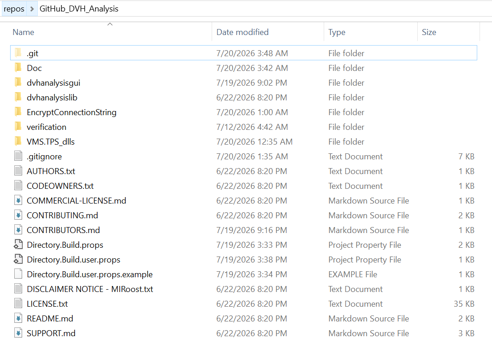
</div>
<br>

* `dvhanalysisgui`: Contains the main WPF UI and a Runner to help its development in Visual Studio.

* `dvhanalysislib`: Contains the calculation lib for DVH Analysis.

* `EncryptConnectionString`: A simple console application to encode SQL connection strings. (This is optional and provides a basic layer of security to prevent storing readable usernames and passwords in the config file.)

* `dvhanalysisgui\SQL_Schema`: Contains SQL queries to create backend SQL tables needed for saving metrics.

* `dvhanalysisgui\resources`: Contains some dll lib needed, pdf user guide, and data files for metrics and templates.

* `dvhanalysisgui\src\UMRO.DvhAnalysis.Script` project is the actual WPF plugin script of DVH Analysis UI, which will be used in Eclipse. The entry point that marks ESAPI binary plugin script (Script class and Execute function) is located in file `"dvhanalysisgui\src\UMRO.DvhAnalysis.Script\Script.cs"`

* `dvhanalysisgui\src\UMRO.DvhAnalysis.Runner` is a helper project that runs/tests the plugin script within Visual Studio. It opens Eclipse application in the background and populates the context needed for `UMRO.DvhAnalysis.Script`, then starts the script in Visual Studio debug environment. It is not needed for deployment. (Development with this Runner helper needs to be on a 'thick' Eclipse client, where Eclipse is locally installed.)

## Build the code

### Provide your own ESAPI reference assemblies

The projects reference `VMS.TPS.Common.Model.API` / `.Types`. These DLLs are **not** part of this repository
(see the note above). Obtain them from your own Varian installation, for example:

* the Eclipse / ESAPI install folder on a thick client (typically under `C:\Program Files (x86)\Varian\...`
  or the GAC), or
* the ESAPI reference assemblies distributed with the Eclipse Scripting API documentation for your Eclipse
  version (available to licensed customers via Varian / MyVarian).

Copy them into a local folder (for example `C:\ESAPI\<version>`) that is **outside** the repository, or keep
them where Varian installed them. Do not commit them to this repository. Then set the folder **once** via any of
(highest precedence first):

1. Copy `Directory.Build.user.props.example` -> `Directory.Build.user.props` and set
   `<EsapiReferencePath>` (gitignored, per-machine); **or**
2. set environment variable `ESAPI_REFERENCE_PATH`; **or**
3. edit the default in `Directory.Build.props`.

Default: `C:\ESAPI\15.6.5.10` (change this to match the ESAPI version of the Eclipse system you deploy to).
`HintPath` is compile-time only — Eclipse loads its own ESAPI at runtime — so thick-client
developers can point this at their local GAC to compile against their installed Eclipse version.

**Important Note**: Build all the projects in x64 configuration, since Eclipse environment is on x64.

<div style="text-align: center;">
    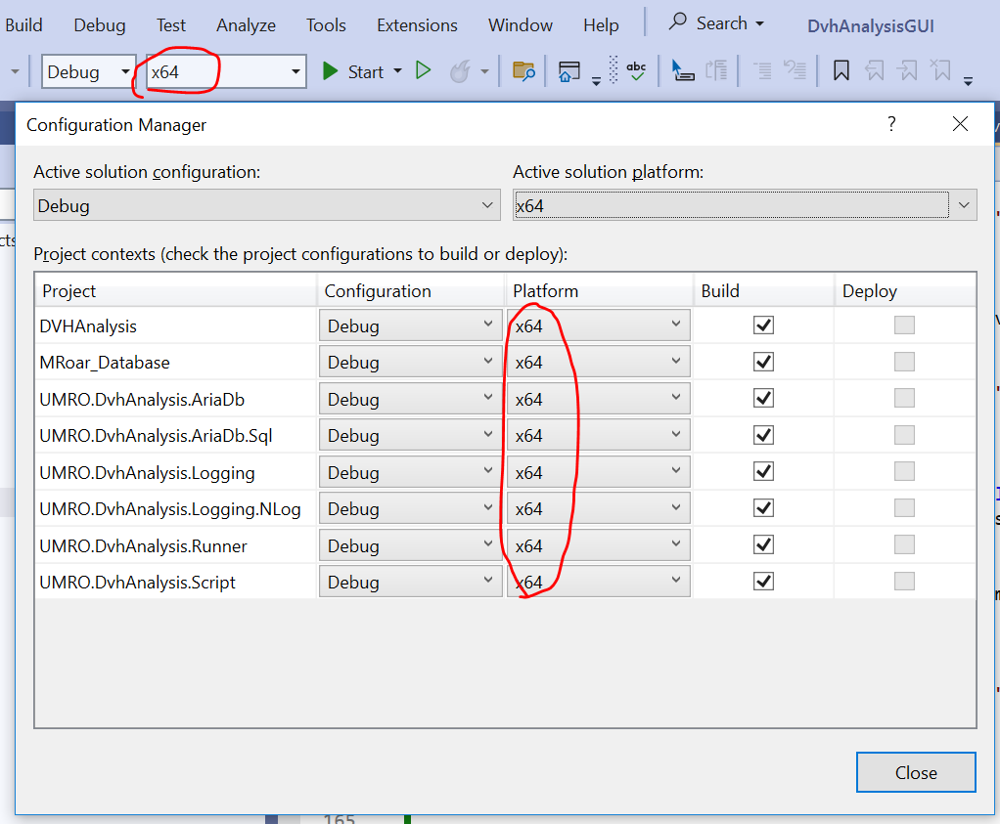
</div>
<br>

If you have Eclipse installed on your machine, you can run the `Runner` project to help test and debug the code. The **entry point** for the code is `dvhanalysisgui\DvhAnalysisGUI.sln`, open it up in Visual Studio. Set `UMRO.DvhAnalysis.Runner` as **Startup** project. (You can build the whole solution on any Windows PC, but to run it in Visual Studio, you need to be on a Thick Eclipse Client.)

<div style="text-align: center;">
    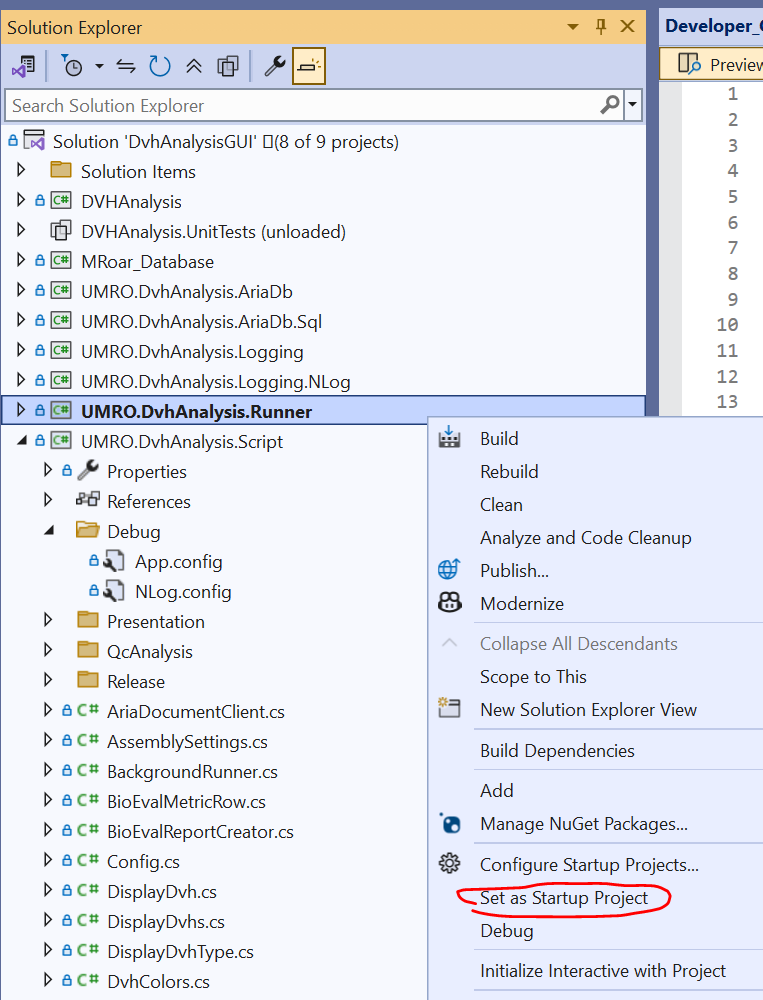
</div>
<br>

## Overall Release Process

1. Update the version of the UMRO.DvhAnalysis.Script project.
2. Update the name of the assembly to include the version.
3. Build either the Debug or Release configuration from Visual Studio.
   (If you want to test run the script in Visual Studio Debug environment, you need to config `App.config` and `NLog.config` first.)
4. Copy the build output files to the appropriate location.
5. Configure the `DVHAnalysis-x.x.x.x.esapi.dll.config` and `NLog.config` for database connection, template location, and log file. See sections below for details.
6. If released to the clinic, tag the Git commit with the
   released version. For example, use `git tag -a 3.0.0.0`.
   The tag message could be "Released to Clinical".

# <h1 style="text-align: center;">Configurations</h1>

## Copy App.config.example --> App.config

An example template of configuration file is included in this repo as [`dvhanalysisgui\src\UMRO.DvhAnalysis.Script\Debug\App.config.example`](../dvhanalysisgui/src/UMRO.DvhAnalysis.Script/Debug/App.config.example). You can copy its content to create a file named `App.config` in the same `\UMRO.DvhAnalysis.Script\Debug` or `\UMRO.DvhAnalysis.Script\Release` folder, and then fill in `App.config` with values from your system. After compiling the code, App.config becomes `DVHAnalysis-x.x.x.x.esapi.dll.config` in the output folder like `/bin/x64/Debug`, and it is the actual config file the program will be using.

**Important Note**: Do NOT edit or put in any secret in **App.config.example** file, since it is tracked by Git. It is only to provide a template for you to create **App.config** file

Each build configuration (Debug and Release) has a separate `App.config` file.
The files are in either the Debug or Release folder in the **UMRO.DvhAnalysis.Script** project.
When the project is built, it picks the correct `App.config` file to copy to the build output.
This is done by the following configuration in the project file:

```
<ItemGroup Condition="'$(Configuration)|$(Platform)' == 'Debug|x64'">
  <None Include="Debug\App.config" />
</ItemGroup>
<ItemGroup Condition="'$(Configuration)|$(Platform)' == 'Release|x64'">
  <None Include="Release\App.config" />
</ItemGroup>
```

**Note:** App.config is and should be ignored in git version control since it contains site specific secrets (current .gitignore file already ignores it).

<div style="page-break-after: always;margin-bottom:50px;"></div>

## Required - Configure Paths to Templates and Resources

This script uses/saves two XML files. The first file contains templates that contain groups of preset metrics to calculate. The other file contains the metric definitions themselves.

Paths to `Resources\Metrics.xml` and `Resources\Templates.xml` must be configured in the `App.config` file (or better in output `DVHAnalysis-x.x.x.x.esapi.dll.config` file).

`Metrics.xml` and `Templates.xml` should be placed in a shared directory accessible to users when they run DVH Analysis script. (Paths starting with `\\` indicate a remote drive. If you run/test the script on a thick Eclipse client locally, you can also use your local C drive path.)

<div style="text-align: center;">
    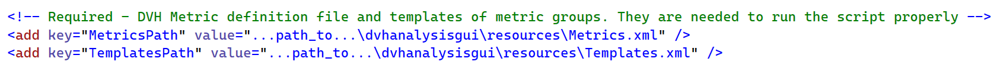
</div>
<br>

<div style="page-break-after: always;margin-bottom:50px;"></div>

## Optional - Configure Log File Path

Log file directory is configured in `App.config` file. If leave empty, log files go to `%LocalAppData%\DVHAnalysis` folder.

<div style="text-align: center;">
    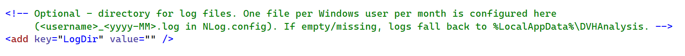
</div>
<br>

Log file names are specified in the NLog configuration file `NLog.config`. Currently userID_yyyy_MM.log pattern is used.

<div style="page-break-after: always;margin-bottom:50px;"></div>

## Optional - Create and Configure a Storage SQL Databases to Save Metrics

DVH Analysis can save various metric values from PlanSetups/PlanSums into a SQL database for later analysis.

<div style="text-align: center;">
    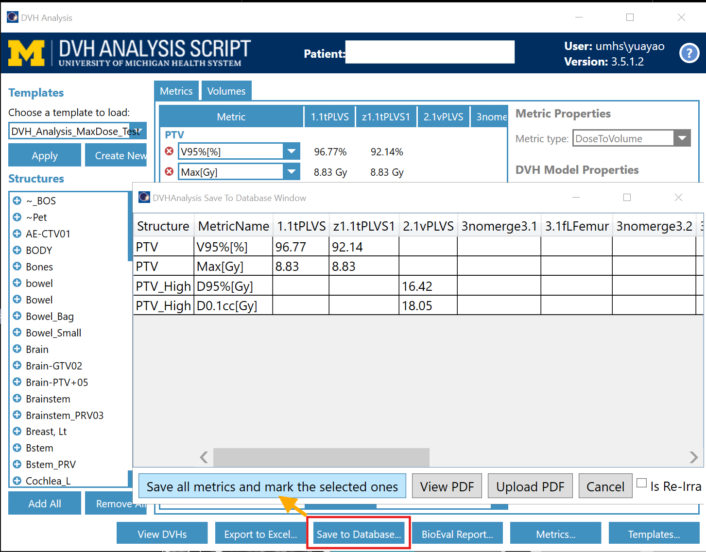
</div>
<br>

If this functionality is required, backend SQL database and tables need to be created and configured. Schema to create these tables are included in [`dvhanalysisgui\SQL_Schema\SQLQuery_Create_Tables_for_Saved_Metrics.sql`](../dvhanalysisgui/SQL_schema/SQLQuery_Create_Tables_for_Saved_Metrics.sql).

<div style="text-align: center;">
    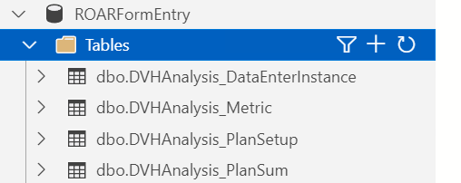
</div>
<br>

Configure the connection string to this SQL server via the **`RoarConnString`**
in the `App.config` or deployed `DVHAnalysis-x.x.x.x.esapi.dll.config`. If `RoarConnString` is absent, saving metrics to database function won't work.

<div style="text-align: center;">
    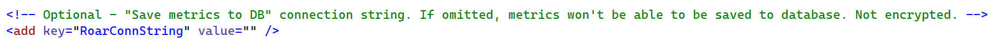
</div>
<br>

<div style="page-break-after: always;margin-bottom:50px;"></div>

## Optional - Create User for ARIA Documents

DVH Analysis can save the info displayed in the script as a PDF report and upload it into Aria patient document:

<div style="text-align: center;">
    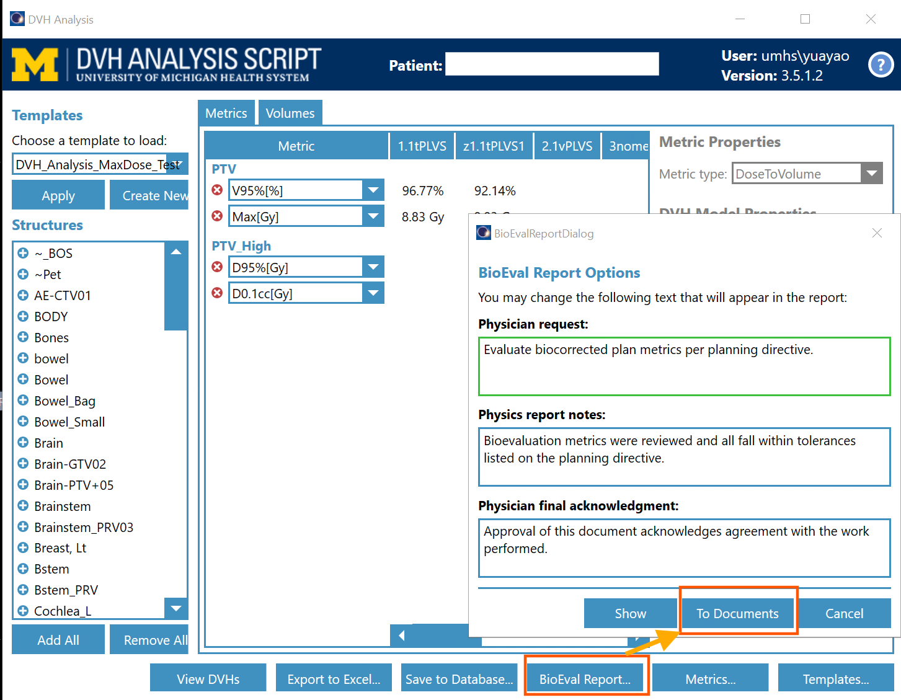
</div>
<br>

If this function of uploading PDF reports from DVH Analysis to the Eclipse Patient Document system is needed, configure **AriaDocAddress**, **AriaDocUsername**, **AriaDocPassword**, and **AriaDocApiKey**. These settings do not have an option for encryption yet. Use simple text values for now. Configure them in `App.config` or better in `DVHAnalysis-x.x.x.x.esapi.dll.config`.

<div style="text-align: center;">
    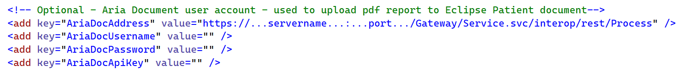
</div>
<br>

**Important note:** If you put any secret/PHI in `App.config`, do NOT commit it in Git. If that happens, do NOT push any branch with that commit in its history to a non-private Git remote.

<div style="page-break-after: always;margin-bottom:50px;"></div>

## Optional - Connection String to ARIA Databases

If you need to save ARIA serial(Ser) numbers of patient/course/plansetup/plansum
into Database with metric values, or to get Physician and Physicist full names in pdf report, complete this section.

DVH Analysis requires data from the ARIA and Shared Framework databases.
It uses the ARIA database to obtain the full name of the oncologist and ARIA serial numbers,
and it uses the Shared Framework database to obtain the full name of the current user.
This requires connection strings for two ARIA databases:

* Database: **Varian** - Tables: **Patient, Course, PlanSetup, PlanSum, Doctor**
* Database: **VarianSharedFrameworkDatabase** - Tables: **Users**

An SQL login (with username and password) with read privileges needs to be created for accessing these tables. Once the login is created, configure the connection strings in the [`dvhanalysisgui\src\UMRO.DvhAnalysis.Script\Debug\App.config`](../dvhanalysisgui/src/UMRO.DvhAnalysis.Script/Debug/App.config) file, or it is even better to specify them in the compilation output file `DVHAnalysis-x.x.x.x.esapi.dll.config`

<div style="text-align: center;">
    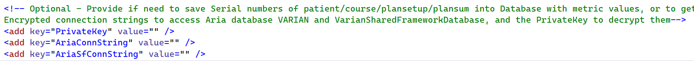
</div>
<br>

* **AriaConnString** should point to the **Varian** database.
* **AriaSfConnString** should point to the **VarianSharedFrameworkDatabase** database.

If human-readable connection strings are acceptable, set **PrivateKey** to "none" and place the connection strings directly in the config file. If not, you can use the console program in `.\EncryptConnectionStrings` to generate an encrypted connection string and private key (see the following section for details).

**Important tips:** If you put any secret/PHI in `App.config`, do NOT commit it in Git. If that happens, do NOT push any branch with that commit in its history to a non-private Git remote.

## Optional - Encrypt SQL Connection String

If preferred, connection strings can be encrypted using a small console app instead of storing them as plain text in `App.config` (or better in output `DVHAnalysis-x.x.x.x.esapi.dll.config` file). Open the solution located in `.\EncryptConnectionString\EncryptConnectionString.sln` with Visual Studio and replace the two connection strings with your own.

<div style="text-align: center;">
    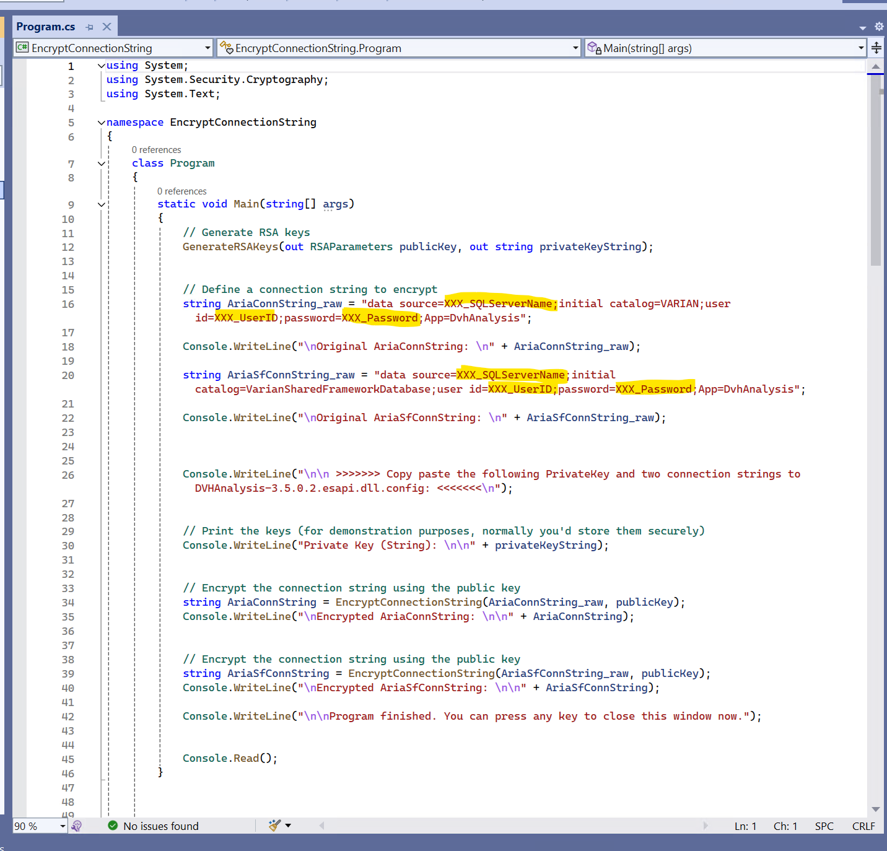
</div>
<br>

Run the program to generate a private key and encrypted connection strings from the console output.

<div style="text-align: center;">
    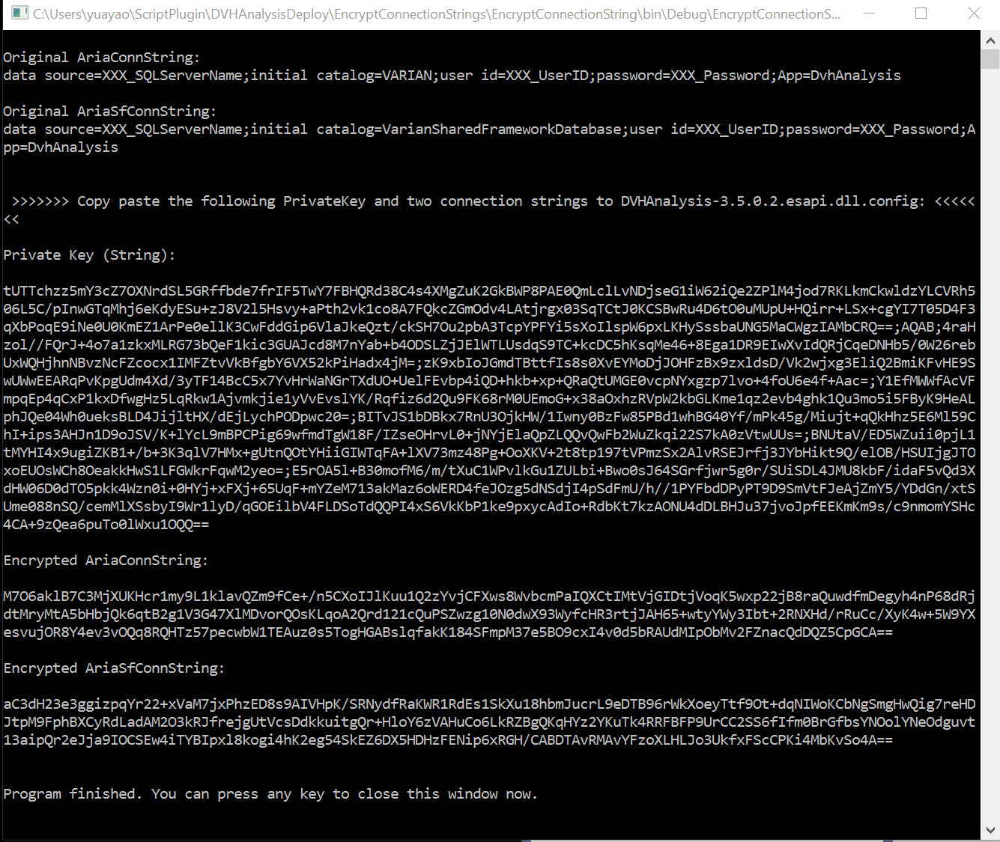
</div>
<br>

Copy and paste the private key and encrypted connection strings into `App.config` (or better in output `DVHAnalysis-x.x.x.x.esapi.dll.config` file). This provides some security by making the connection strings non-human-readable. However, be aware that since the private key is stored in the config file, someone with technical expertise could decrypt the connection strings. Additional security measures may be needed depending on your deployment requirements.

**Note**: This section is optional. If you do not need to encrypt connection strings, simply set **PrivateKey** to "none" in the `App.config` file (or better in output `DVHAnalysis-x.x.x.x.esapi.dll.config` file).

**Important Note**: Try not to include these secrets (**EncryptConnectionString\Program.cs** and **App.config**) in your git commits, particularly if you want to publish your work back to this GitHub repo.

<div style="page-break-after: always;margin-bottom:50px;"></div>

# <h1 style="text-align: center;">How to Start DVH Analysis</h1>

After completing all configurations and build (compile) project `UMRO.DvhAnalysis.Script` successfully, you can use the script in the following way:

1. Open Eclipse External Planning and load treatment plans. Click **Tools** and select **Scripts...** from the dropdown menu.

<div style="text-align: center;">
    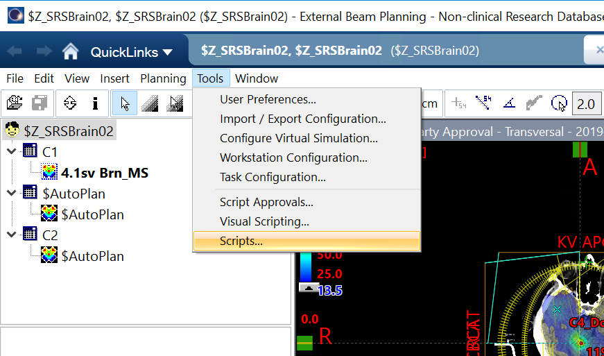
</div>
<br>

2. **Change Folder** to where `DVHAnalysis-x.x.x.x.esapi.dll` is located, likely `dvhanalysisgui\src\UMRO.DvhAnalysis.Script\bin\x64\Debug`.

   You can deploy (rename and relocate) this `Debug` folder to another location where your users can easily access.

<div style="text-align: center;">
    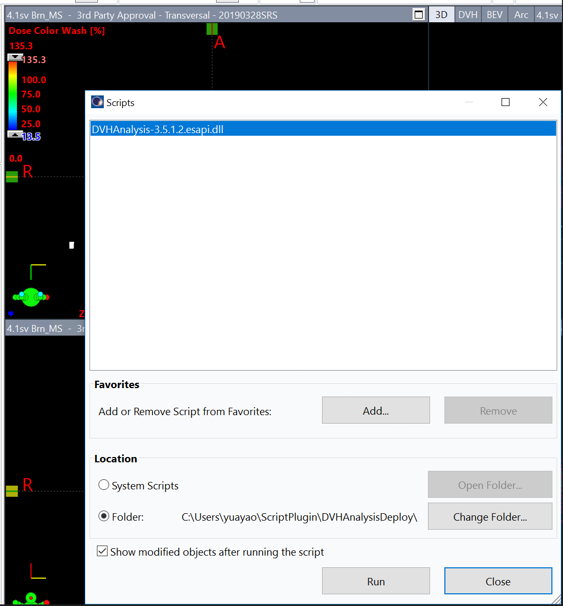
</div>
<br>

3. Click **Open**, even if no `.esapi.dll` file is visible.

<div style="text-align: center;">
    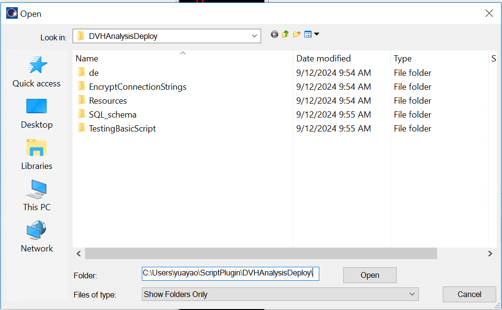
</div>
<br>

4. You should now see `DVHAnalysis-x.x.x.x.esapi.dll` in the **Scripts** window (from Step 2). Double-click it or click **Run**. If the plugin runs successfully and was configured properly, the pull-down list for metrics and templates should not be empty.

       Ensure that some PlanSetups/PlanSums are loaded in Eclipse for the patient before starting the plugin.

<div style="text-align: center;">
    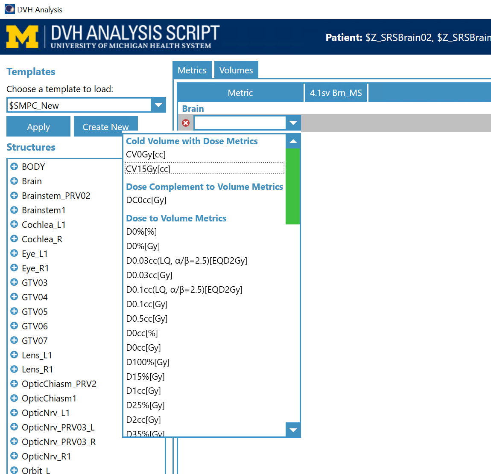
</div>
<br>

# <h1 style="text-align: center;">How to Verify Results</h1>

An Independent Verification Harness in Python has been developed by Brian Anderson. It compares metrics calculated from DVH Analysis with values from DICOM. See [`verification/README.md`](../verification/README.md) for details.
