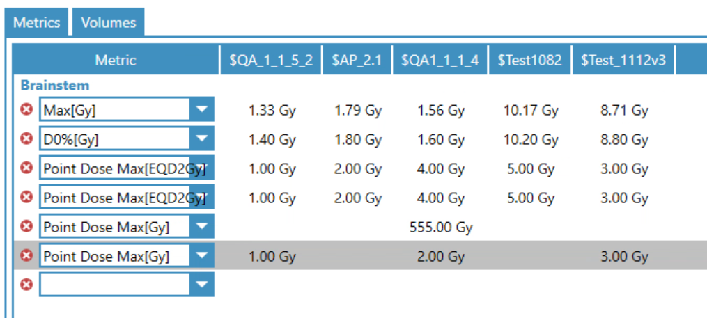
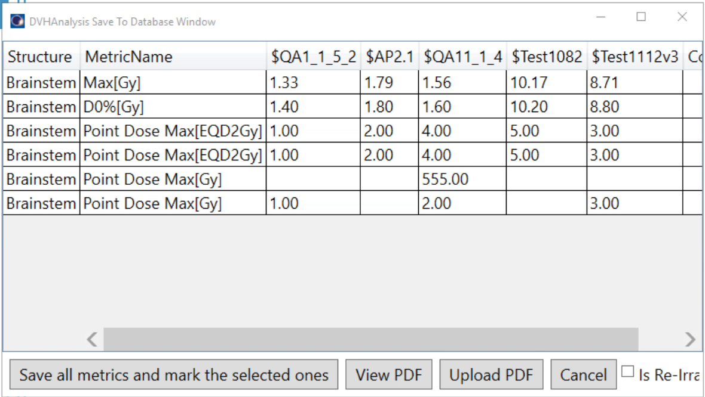
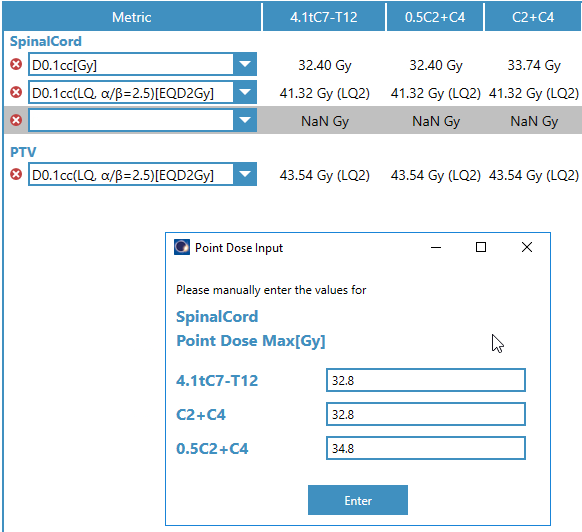
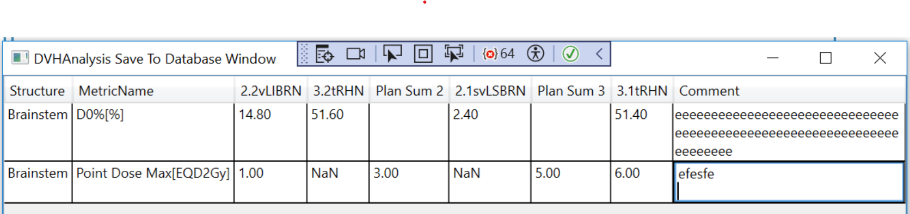
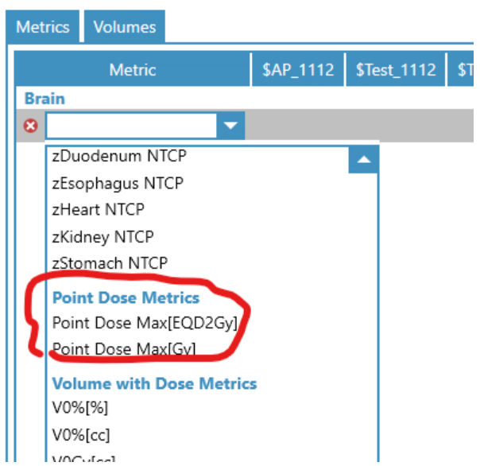
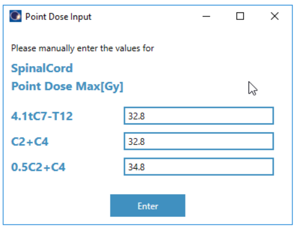
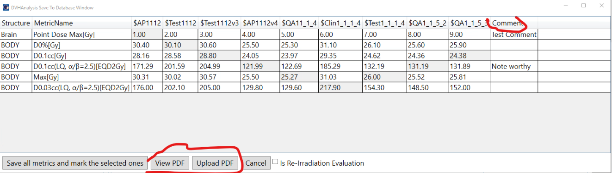
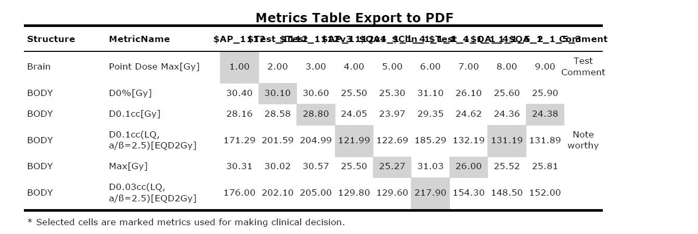
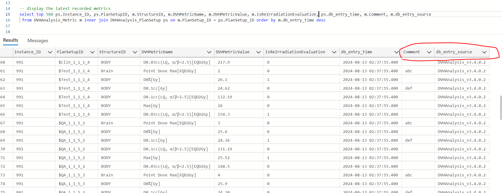

# Version Updates Tracking

Only the following recent versions are included:

- [DVH Analysis v3.5.1.x](#dvh-analysis-v351x)
- [DVH Analysis v3.5.0.x](#dvh-analysis-v350x)
- [DVH Analysis v3.4.1.x](#dvh-analysis-v341x)
- [DVH Analysis v3.4.0.x](#dvh-analysis-v340x)

# <h1 style="text-align: center;">DVH Analysis v3.5.1.x</h1>

Replace NaN with simply leaving cells blank, in both Main view window and Save to DB window.  

    

 

    

# <h1 style="text-align: center;">DVH Analysis v3.5.0.x</h1>

**Bug Fix:** Sync all referenced assembly versions to 3.5.0.2. Since Eclipse may load previous version (1.0.0.0) of AriaDb.Sql.

These referenced dll version may stay at 3.5.0.2 for a while as long as they are not changed. So DVH_Analysis version may get larger than its referenced dll assemble versions in the future.

# <h1 style="text-align: center;">DVH Analysis v3.4.1.x</h1>

- **Bug Fix:** Fix column order discrepancy (between main and SaveToDB window):
  

    

<em>Error example</em>

  
 

- Comment field in SaveToDB window datagrid can have text wrapped:

    

 

# <h1 style="text-align: center;">DVH Analysis v3.4.0.x</h1>

- Two Point Dose Metrics (which takes manual type-in values) have been added:

    

 

    

 

- PDF file can be created and uploaded to Aria Patient Document from the Save to Database window:

    

 

    

 

- Two new columns, Comment and db_entry_source, have been added in the Metric table:

    

 

